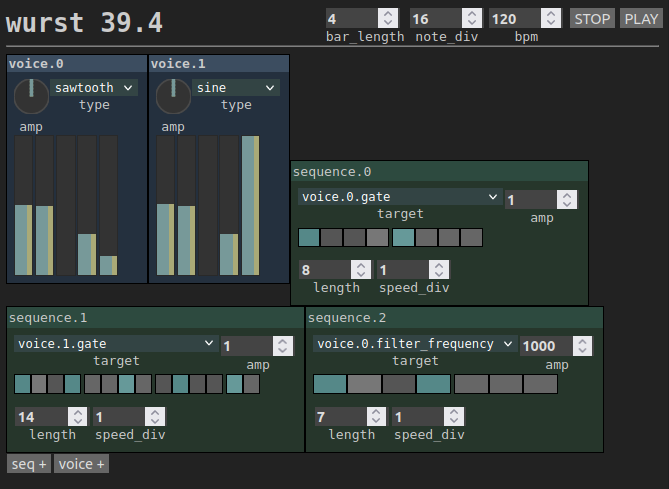

# WURST

or Web-Utilized React Synthesizer Test, is just that. A browser-based
synthesizer with UI painted by React. 

And it's really just a test. 
The sequencer event-loop is driven by plain `setTimeout()`s on React
dispatchers.

So it behaves a bit random, like old analog machines when room temperature
changes. Only, in this case the garbage collector might be to blame.
Actually on my linux, with intellij running besides the song tempo
changes drastically when typing the javascript ;)

Nice weekend project but apart from the WebAudio API which is quite
inspiring, it's yet another struggle with state management, render
performance and pure CSS and user-experience in the first place.

No, i'm not a good interface designer by nature.

